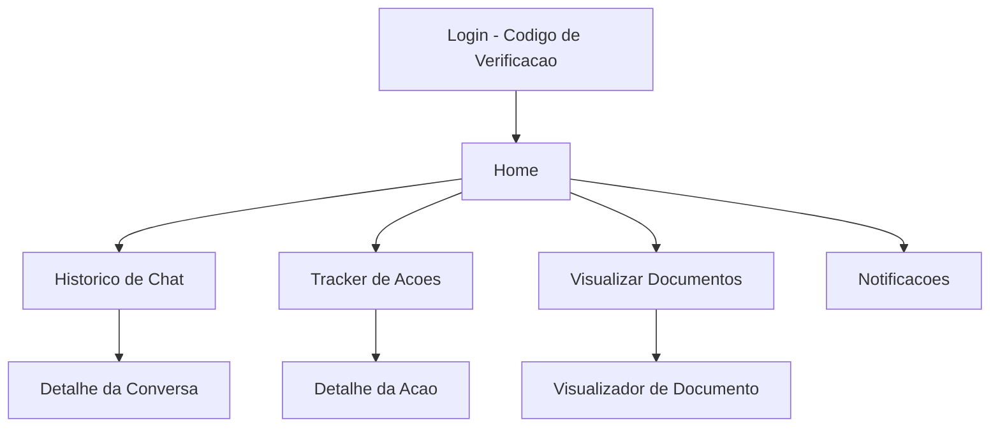
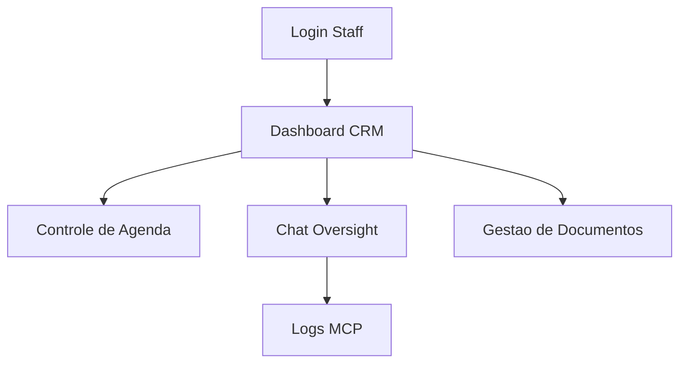
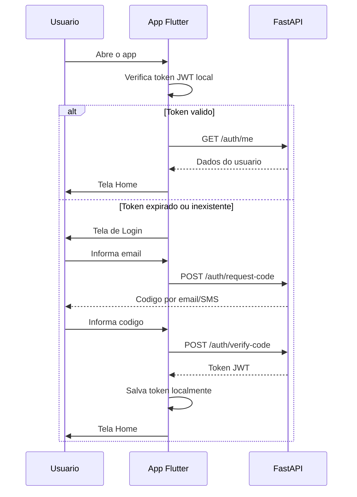
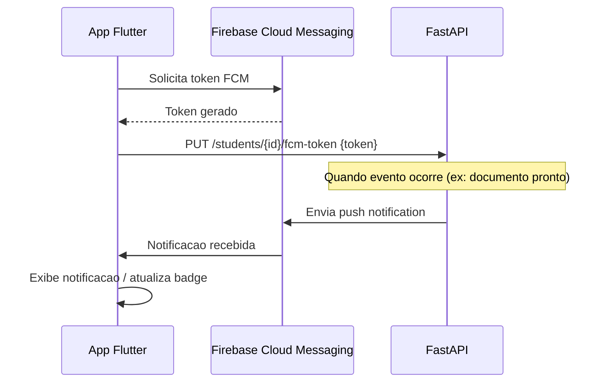

# App Flutter - Features (MVP)

## Visao Geral

App Flutter (Mobile/Web) com dois perfis de acesso:
- **Cliente (Aluno)**: Visualiza status, historico de chats, documentos e recebe notificacoes
- **Fornecedor (Staff)**: Dashboard de gestao, controle de agenda e interacao com dados extraidos pela IA

---

## Perfil: Cliente (MVP)

### Telas

#### 1. Login
- Aluno informa email institucional
- Recebe codigo de verificacao (email/SMS)
- Digita codigo para autenticar
- **Endpoints**: `POST /auth/request-code`, `POST /auth/verify-code`

#### 2. Home
- Resumo com status das acoes recentes
- Notificacoes nao lidas (badge)
- Acesso rapido as 4 funcionalidades

#### 3. Historico de Chat
- Lista de sessoes de chat com o bot (WhatsApp)
- Cada sessao mostra data, status e preview da ultima mensagem
- Detalhe: todas as mensagens da conversa (role user/assistant)
- **Endpoints**: `GET /chat-sessions`, `GET /chat-sessions/{id}/messages`

#### 4. Tracker de Acoes
- Lista de acoes executadas pelo chatbot em nome do aluno
- Cada acao mostra: tool usada, data, status (sucesso/erro)
- Filtro por tipo de acao
- **Endpoints**: `GET /chat-sessions/{id}/action-logs`

#### 5. Visualizar Documentos
- Lista de documentos solicitados com status (solicitado, processando, pronto, entregue)
- Documentos prontos: botao para download/visualizacao
- **Endpoints**: `GET /documents`, `GET /documents/{id}`

#### 6. Notificacoes
- Lista de notificacoes push recebidas via FCM
- Tipos: documento pronto, status de acao, lembretes
- Marca como lida ao abrir
- **Integracao**: Firebase Cloud Messaging (FCM)
- **Endpoint**: `PUT /students/{id}/fcm-token` (registro do token)

---

## Perfil: Fornecedor (To Evolve)

Dashboard CRM com escopo a ser definido nas proximas fases. Funcionalidades previstas:

- Dashboard com KPIs (alunos ativos, documentos pendentes, agendamentos)
- Controle de agenda (criar/gerenciar slots de atendimento)
- Visualizacao de sessoes de chat e logs MCP
- Interacao com dados extraidos pela IA
- Gestao de documentos (atualizar status)

> Detalhamento sera feito em fase futura.

---

## Fluxo de Autenticacao no App

---

## Integracao FCM

---

## Padroes de Integracao com API

| Padrao | Descricao |
|--------|-----------|
| **Auth** | Token JWT armazenado com `flutter_secure_storage`, enviado no header `Authorization: Bearer {token}` |
| **HTTP Client** | `dio` ou `http` package com interceptor para refresh/logout automatico |
| **Estado** | Gerenciamento de estado (a definir: Provider, Riverpod ou Bloc) |
| **Cache** | Cache local para dados consultados frequentemente (historico de chat) |
| **Offline** | Exibe dados em cache quando offline, sincroniza ao reconectar |
| **Erro** | Tratamento padronizado de erros da API com feedback visual |
