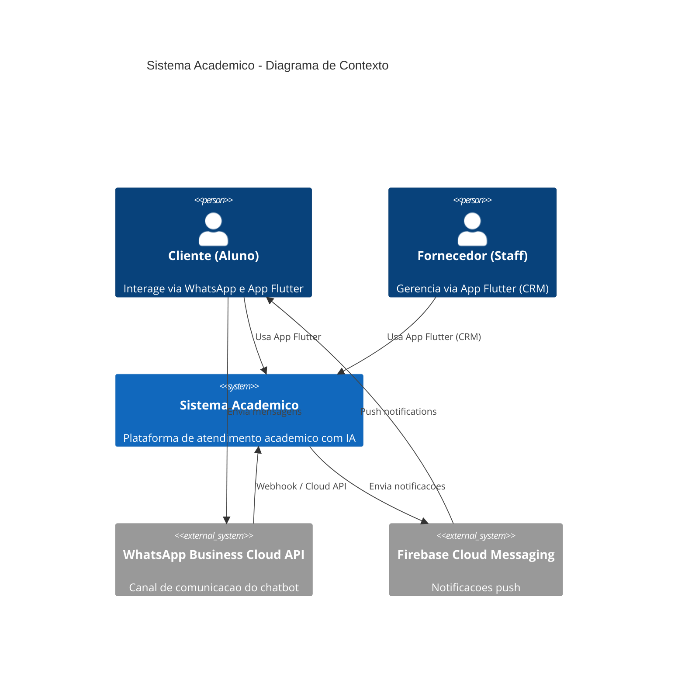
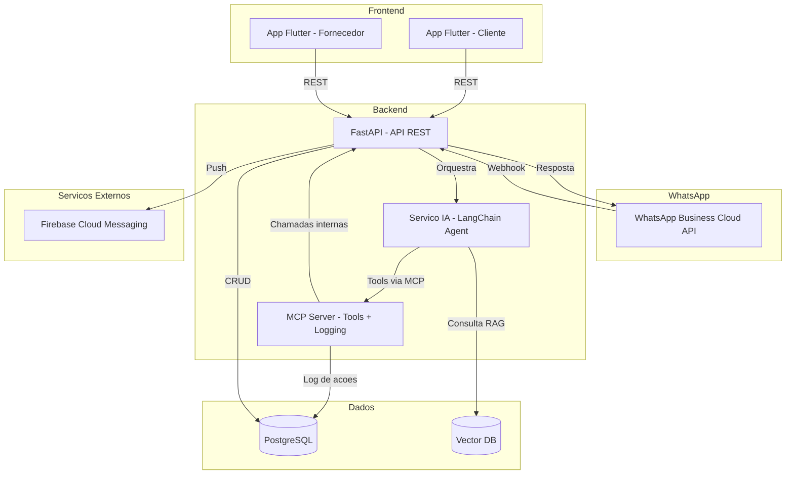
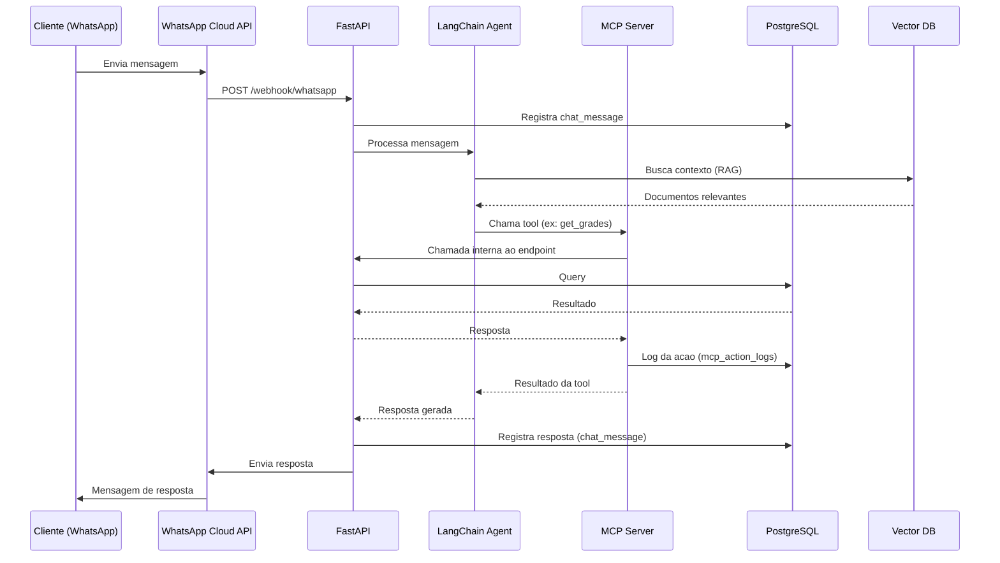
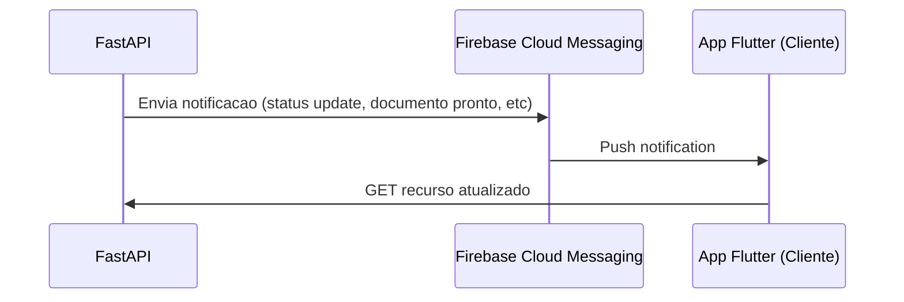
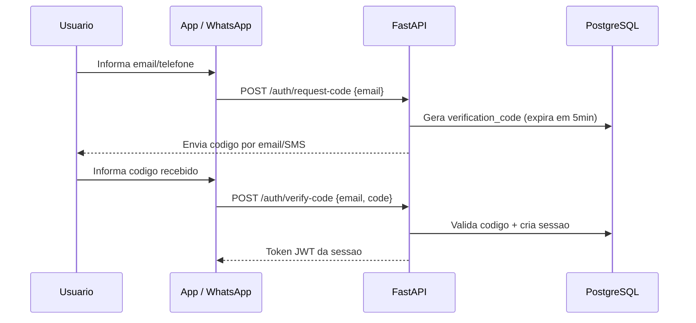
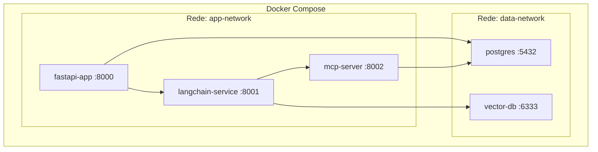

# Arquitetura do Sistema

## Visao Geral

Sistema academico para o curso de Ciencia da Computacao (8 periodos) composto por:

- **Chatbot WhatsApp** com IA (LangChain + RAG) para atendimento de secretaria
- **App Flutter** (Mobile/Web) para Cliente e Fornecedor
- **API Backend** (FastAPI) como camada central
- **PostgreSQL** + Vector DB para persistencia e RAG
- **Firebase Cloud Messaging (FCM)** para notificacoes push

---

## Diagrama de Contexto (C4 - Level 1)

---

## Diagrama de Componentes

---

## Fluxo de Mensagem WhatsApp

---

## Fluxo de Notificacao Push (FCM)

---

## Fluxo de Autenticacao (Codigo de Verificacao)

---

## Topologia Docker

| Container | Imagem | Porta | Descricao |
|-----------|--------|-------|-----------|
| fastapi-app | python:3.12 | 8000 | API REST principal |
| langchain-service | python:3.12 | 8001 | Agente IA com LangChain |
| mcp-server | python:3.12 | 8002 | MCP Server (tools + logging) |
| postgres | postgres:16 | 5432 | Banco de dados principal |
| vector-db | (a definir) | 6333 | Vector DB para RAG |

---

## Tech Stack

| Camada | Tecnologia | Uso |
|--------|-----------|-----|
| Frontend | Flutter | App Mobile/Web (Cliente + Fornecedor) |
| Backend | FastAPI (Python) | API REST |
| IA | LangChain | Orquestracao do agente |
| RAG | Vector DB (a definir) | Retrieval-Augmented Generation |
| Chatbot | WhatsApp Business Cloud API | Canal de atendimento |
| Banco | PostgreSQL | Dados relacionais |
| Notificacoes | Firebase Cloud Messaging | Push notifications |
| Infra | Docker / LXC | Containerizacao |
| Protocolo | MCP | Tool calling + Logging |
