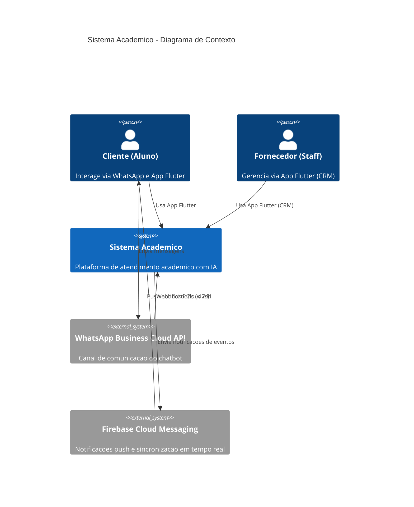
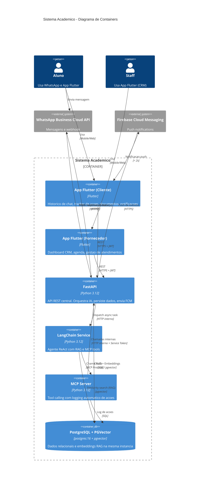
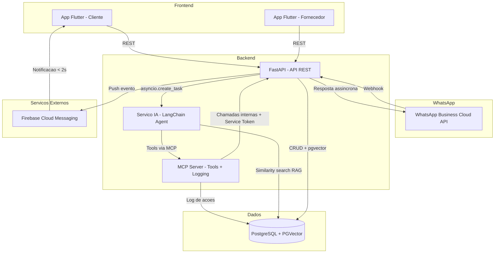
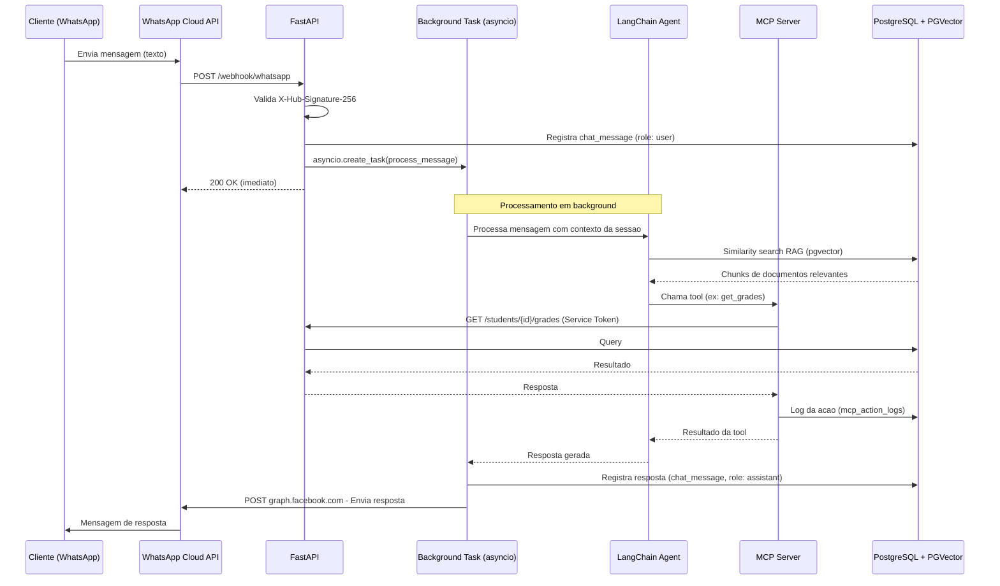
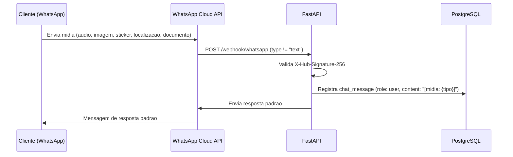
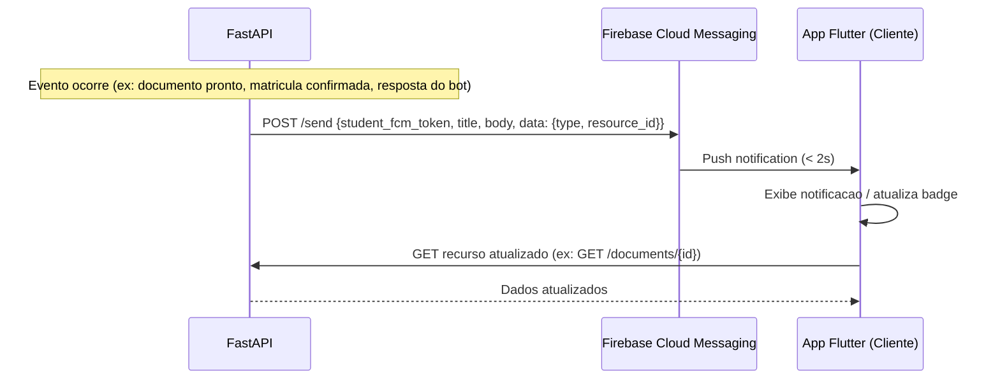
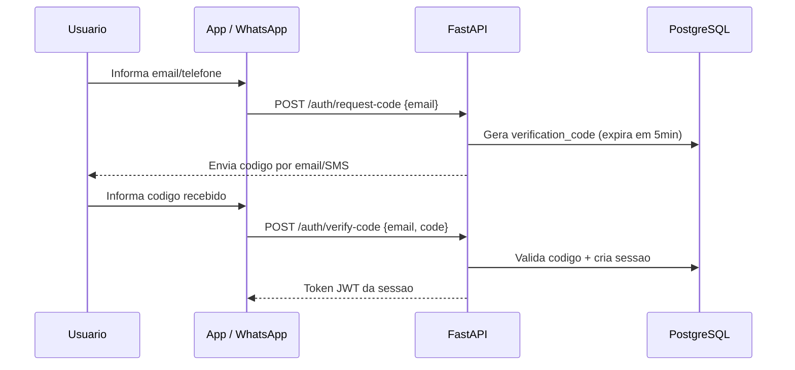
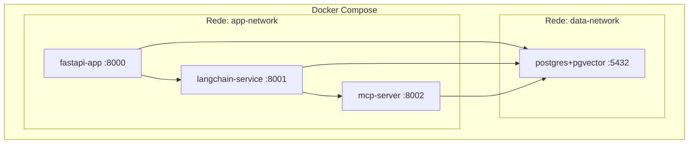

# Arquitetura do Sistema

## Visao Geral

Sistema academico para o curso de Ciencia da Computacao (8 periodos) composto por:

- **Chatbot WhatsApp** com IA (LangChain + RAG) para atendimento de secretaria
- **App Flutter** (Mobile/Web) para Cliente e Fornecedor
- **API Backend** (FastAPI) como camada central
- **PostgreSQL** + PGVector para persistencia relacional e RAG
- **Firebase Cloud Messaging (FCM)** para notificacoes push e sincronizacao em tempo real

---

## Diagrama de Contexto (C4 - Level 1)

---

## Diagrama de Containers (C4 - Level 2)

---

## Diagrama de Componentes

---

## Fluxo de Mensagem WhatsApp (Pseudo-Assincrono)

O webhook responde 200 OK imediatamente ao WhatsApp e despacha o processamento da IA em background via asyncio.create_task. Isso evita timeout (limite de ~5s da Meta) e garante estabilidade durante chamadas mais lentas ao LLM.

---

## Fluxo de Mensagem WhatsApp (Midia - MVP)

Quando o aluno envia mensagem de midia, o bot responde com mensagem padrao orientando
o uso de texto. O tipo da midia e registrado no banco para auditoria.

### Respostas Padrao por Tipo de Midia (MVP)

| Tipo de Midia | Resposta do Bot                                                                              |
| ------------- | -------------------------------------------------------------------------------------------- |
| audio         | "Nao consigo processar audios ainda. Por favor, descreva sua duvida em texto."               |
| image         | "Nao consigo analisar imagens ainda. Por favor, descreva o que precisa em texto."            |
| document      | "Recebi um documento, mas nao consigo processa-lo ainda. Descreva sua solicitacao em texto." |
| sticker       | "Por favor, descreva sua duvida em texto para que eu possa te ajudar."                       |
| location      | "Nao preciso da sua localizacao. Como posso te ajudar? Digite sua duvida."                   |
| video         | "Nao consigo processar videos. Por favor, descreva sua solicitacao em texto."                |

Roadmap pos-MVP (INCERTO):
audio → transcricao via Whisper API (OpenAI)
image → descricao e analise via GPT-4o Vision

---

## Fluxo de Notificacao Push e Sincronizacao em Tempo Real (FCM)

---

## Eventos que Disparam FCM

| Evento                     | Payload data                                    | Tela atualizada no App |
| -------------------------- | ----------------------------------------------- | ---------------------- |
| Documento pronto           | {type: "document_ready", document_id}           | Visualizar Documentos  |
| Matricula confirmada       | {type: "enrollment_confirmed", enrollment_id}   | Tracker de Acoes       |
| Agendamento confirmado     | {type: "appointment_confirmed", appointment_id} | Tracker de Acoes       |
| Resposta do bot processada | {type: "chat_reply", session_id}                | Historico de Chat      |
| Status de acao atualizado  | {type: "action_status", log_id}                 | Tracker de Acoes       |

---

## Fluxo de Autenticacao (Codigo de Verificacao)

---

## Topologia Docker

| Container         | Imagem                 | Porta | Descricao                                             |
| ----------------- | ---------------------- | ----- | ----------------------------------------------------- |
| fastapi-app       | python:3.12            | 8000  | API REST principal                                    |
| langchain-service | python:3.12            | 8001  | Agente IA com LangChain                               |
| mcp-server        | python:3.12            | 8002  | MCP Server (tools + logging)                          |
| postgres          | pgvector/pgvector:pg16 | 5432  | Banco de dados principal + extensao PGVector para RAG |

Nota PGVector: A imagem pgvector/pgvector:pg16 ja inclui a extensao instalada.
Basta executar CREATE EXTENSION IF NOT EXISTS vector; no init do banco.
Nao e necessario container separado para o Vector DB.

---

## Tech Stack

| Camada       | Tecnologia                     | Uso                                                     |
| ------------ | ------------------------------ | ------------------------------------------------------- |
| Frontend     | Flutter                        | App Mobile/Web (Cliente + Fornecedor)                   |
| Backend      | FastAPI (Python)               | API REST                                                |
| IA           | LangChain                      | Orquestracao do agente ReAct                            |
| RAG          | PGVector (extensao PostgreSQL) | Retrieval-Augmented Generation                          |
| Chatbot      | WhatsApp Business Cloud API    | Canal de atendimento                                    |
| Banco        | PostgreSQL 16                  | Dados relacionais + vetores RAG                         |
| Notificacoes | Firebase Cloud Messaging       | Push notifications e sincronizacao em tempo real (< 2s) |
| Infra        | Docker / LXC                   | Containerizacao                                         |
| Protocolo    | MCP                            | Tool calling + Logging                                  |
| Async        | asyncio.create_task (FastAPI)  | Processamento assincrono do webhook                     |
