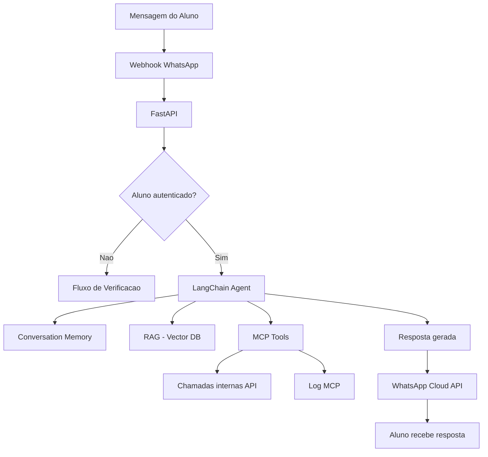
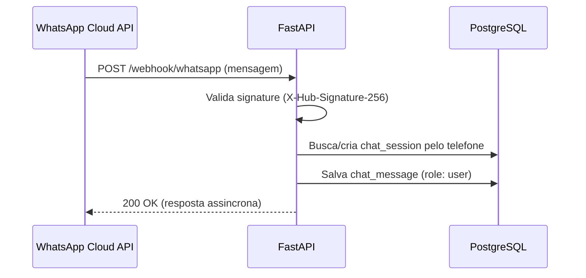
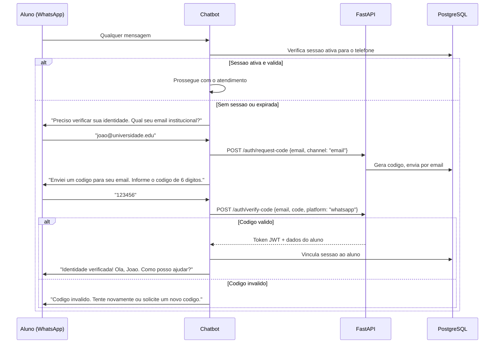
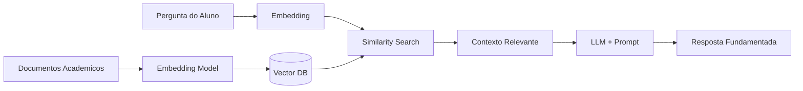
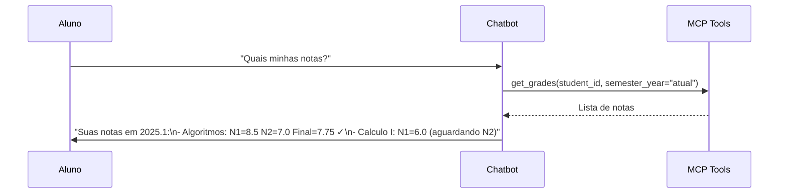
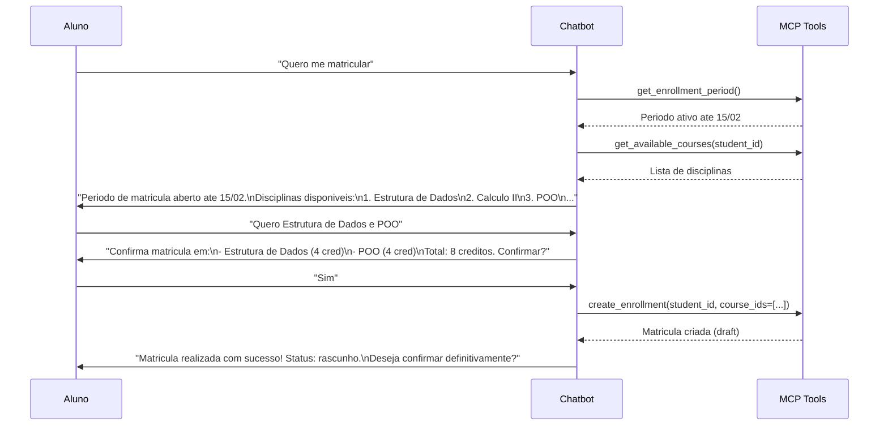
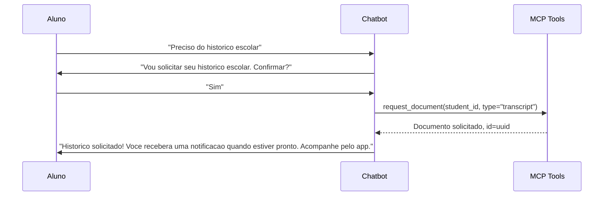
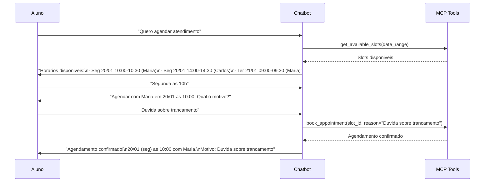

# Chatbot WhatsApp - Fluxos e Arquitetura

## Visao Geral

O chatbot atende alunos do curso de Ciencia da Computacao via WhatsApp, usando LangChain para orquestracao e RAG para consulta de regras academicas. As acoes sao executadas via MCP tools que chamam a API REST.

---

## Arquitetura do Agente LangChain



### Componentes do Agente

| Componente | Tecnologia | Funcao |
|------------|-----------|--------|
| Agent | LangChain ReAct Agent | Decide qual tool usar com base na mensagem |
| LLM | (a definir) | Modelo de linguagem para gerar respostas |
| Memory | ConversationBufferWindowMemory | Mantem contexto das ultimas N mensagens |
| Tools | MCP Tools | Acoes concretas (consultar notas, matricular, etc) |
| RAG | Vector DB + LangChain Retriever | Busca informacoes em documentos academicos |

---

## Integracao WhatsApp Business API

### Webhook

O WhatsApp Business Cloud API envia mensagens via webhook:



### Envio de Resposta

```
POST https://graph.facebook.com/v18.0/{phone_number_id}/messages
Authorization: Bearer {WHATSAPP_TOKEN}

{
  "messaging_product": "whatsapp",
  "to": "5521999999999",
  "type": "text",
  "text": {"body": "Suas notas do periodo 2025.1: ..."}
}
```

---

## Fluxo de Verificacao de Identidade



---

## Tabela de Intents

| Intent (Portugues) | Acao do Agente | MCP Tool |
|---------------------|---------------|----------|
| "Quais minhas notas?" / "Como estao minhas notas?" | Consulta notas do periodo atual | `get_grades` |
| "Quero meu historico escolar" | Solicita documento de historico | `request_document` |
| "Quero me matricular" / "Quais disciplinas posso cursar?" | Lista disciplinas disponiveis | `get_available_courses` |
| "Matricula em Estrutura de Dados e Calculo II" | Cria matricula com disciplinas | `create_enrollment` |
| "Quero trancar a matricula" | Tranca matricula | `lock_enrollment` |
| "Remover Calculo II da matricula" | Remove disciplina | `drop_course` |
| "Quero agendar atendimento" / "Horarios disponiveis" | Lista slots | `get_available_slots` |
| "Agendar para segunda as 10h" | Agenda atendimento | `book_appointment` |
| "Cancelar meu agendamento" | Cancela atendimento | `cancel_appointment` |
| "Como funciona o trancamento?" / "Qual o prazo de matricula?" | Consulta regras via RAG | RAG retrieval |
| "Quais os pre-requisitos de IA?" | Consulta pre-requisitos | `get_course_prerequisites` |
| "Qual a grade curricular?" | Mostra curriculo | `get_curriculum` |
| "Status do meu documento" | Verifica status | `get_document_status` |
| "Meus dados" / "Meu resumo academico" | Resumo do aluno | `get_student_info` |

---

## Design do Agente

### System Prompt

```
Voce e o assistente virtual da secretaria academica do curso de Ciencia da Computacao.

Regras:
1. Sempre responda em portugues brasileiro.
2. Antes de executar qualquer acao que altere dados (matricula, trancamento, agendamento),
   confirme com o aluno.
3. Use as tools disponiveis para consultar e executar acoes.
4. Para duvidas sobre regras academicas, consulte a base de conhecimento (RAG).
5. Seja claro e objetivo nas respostas.
6. Se nao souber responder, oriente o aluno a procurar a secretaria presencialmente.
7. Nunca invente informacoes - use apenas dados das tools e do RAG.
```

### Tool Binding

O agente LangChain recebe as MCP tools como funcoes invocaveis. Cada tool tem:
- Nome e descricao
- Schema de parametros (JSON Schema)
- Funcao que chama o endpoint da API correspondente

### Conversation Memory

- **Tipo**: ConversationBufferWindowMemory (k=10)
- **Persistencia**: Mensagens salvas em `chat_messages` no PostgreSQL
- **Restauracao**: Ao retomar sessao, carrega ultimas 10 mensagens do banco

---

## Pipeline RAG



### Knowledge Base (conteudo para RAG)

| Categoria | Exemplos de Documentos |
|-----------|----------------------|
| Regras de matricula | Prazos, numero maximo de disciplinas, regras de trancamento |
| Curriculo | Disciplinas por periodo, ementas, pre-requisitos |
| Regulamento academico | Aprovacao, reprovacao, jubilamento, frequencia minima |
| Documentos | Tipos disponiveis, prazo de emissao, requisitos |
| Agendamento | Horarios de funcionamento, tipos de atendimento |
| FAQ | Perguntas frequentes da secretaria |

---

## Diagramas de Conversacao

### Fluxo: Consulta de Notas



### Fluxo: Matricula em Disciplinas



### Fluxo: Solicitacao de Documento



### Fluxo: Agendamento



---

## Tratamento de Erros

| Situacao | Resposta do Bot |
|----------|----------------|
| API indisponivel | "Desculpe, estou com dificuldades tecnicas. Tente novamente em alguns minutos." |
| Periodo de matricula fechado | "O periodo de matricula nao esta aberto. Proximo periodo: {data}." |
| Pre-requisito nao cumprido | "Voce nao pode cursar {disciplina} pois falta o pre-requisito: {prereq}." |
| Aluno nao encontrado | "Nao encontrei seu cadastro. Procure a secretaria presencialmente." |
| Slots esgotados | "Nao ha horarios disponiveis para o periodo solicitado. Tente outra data." |
| Intent nao reconhecido | "Nao entendi sua solicitacao. Posso ajudar com: notas, matricula, documentos, agendamentos e informacoes do curso. Deseja entrar em contato com a secretaria?" |
