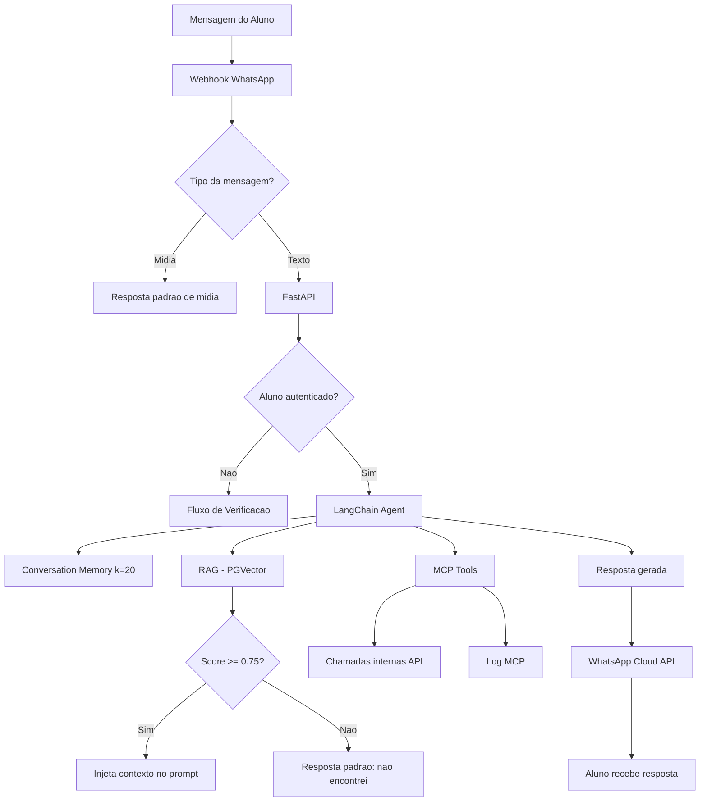
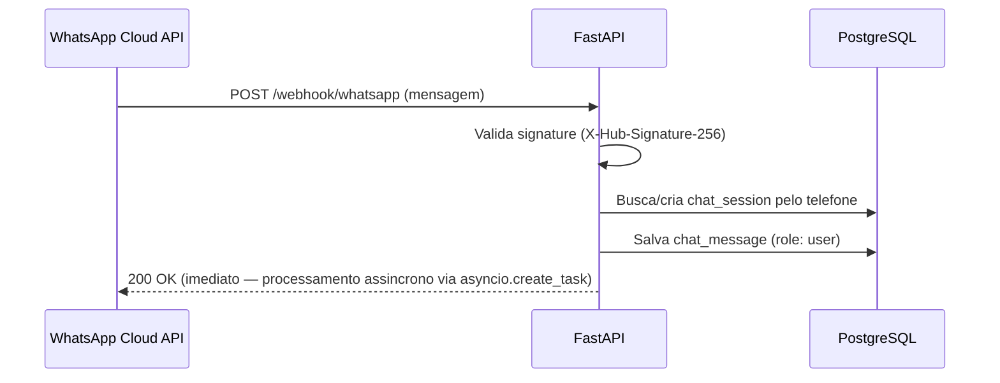
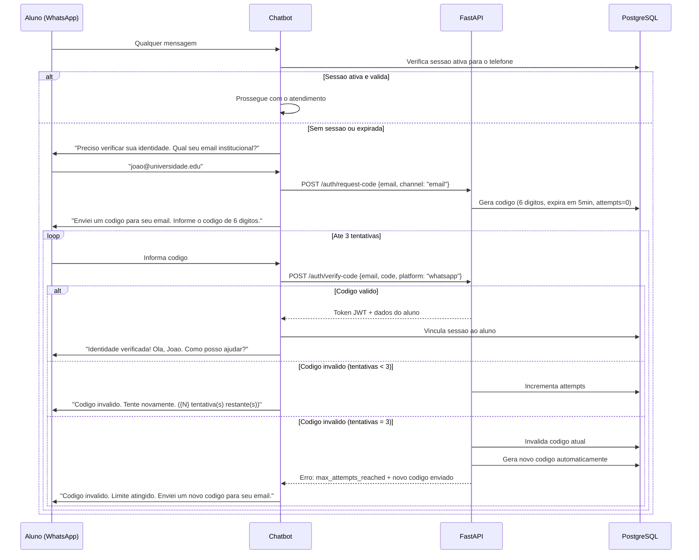
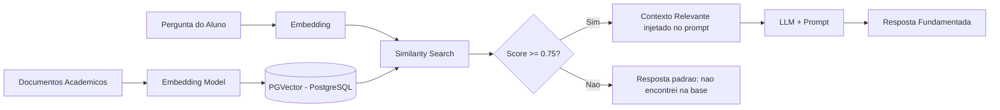
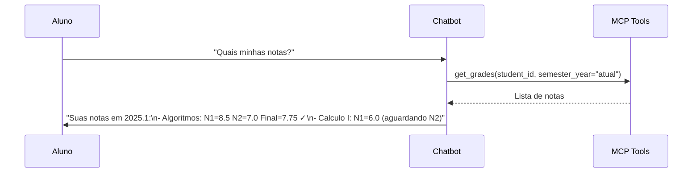
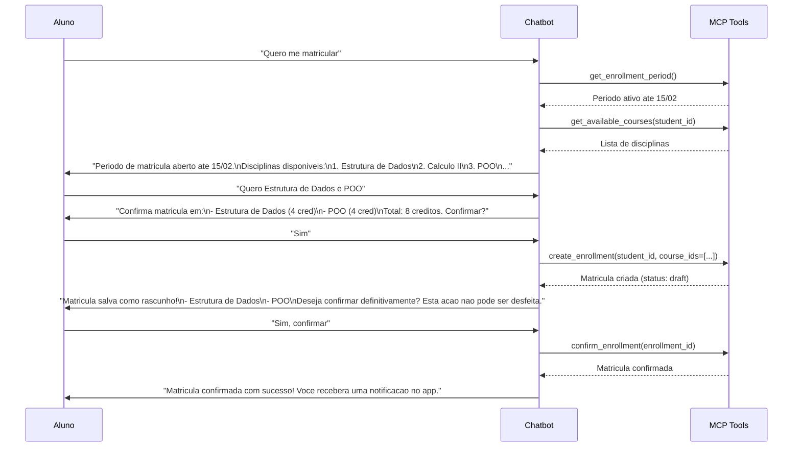
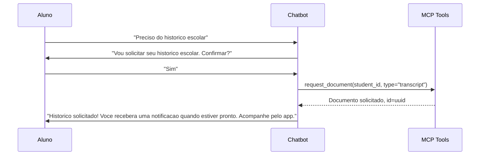
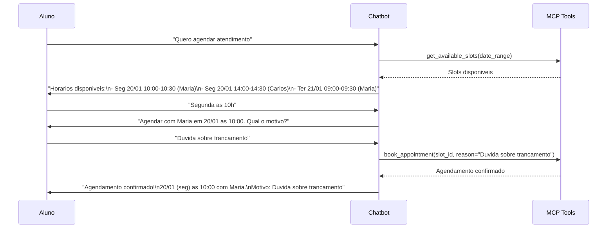

# Chatbot WhatsApp - Fluxos e Arquitetura

## Visao Geral

O chatbot atende alunos do curso de Ciencia da Computacao via WhatsApp, usando LangChain para
orquestracao e RAG para consulta de regras academicas. As acoes sao executadas via MCP tools
que chamam a API REST.

---

## Arquitetura do Agente LangChain



### Componentes do Agente

| Componente | Tecnologia                            | Funcao                                                        |
| ---------- | ------------------------------------- | ------------------------------------------------------------- |
| Agent      | LangChain ReAct Agent                 | Decide qual tool usar com base na mensagem                    |
| LLM        | (a definir)                           | Modelo de linguagem para gerar respostas                      |
| Memory     | ConversationBufferWindowMemory (k=20) | Mantem contexto das ultimas 20 mensagens                      |
| Tools      | MCP Tools                             | Acoes concretas (consultar notas, matricular, etc)            |
| RAG        | PGVector + LangChain Retriever        | Busca informacoes em documentos academicos com threshold 0.75 |

---

## Integracao WhatsApp Business API

### Webhook

O WhatsApp Business Cloud API envia mensagens via webhook:



### Envio de Resposta

```
POST https://graph.facebook.com/v18.0/{phone_number_id}/messages
Authorization: Bearer {WHATSAPP_TOKEN}

{
  "messaging_product": "whatsapp",
  "to": "5521999999999",
  "type": "text",
  "text": {"body": "Suas notas do periodo 2025.1: ..."}
}
```

---

## Tratamento de Mensagens de Midia (MVP)

Mensagens que nao sao do tipo `text` recebem resposta padrao imediata, sem passar pelo agente.
O tipo da midia e registrado em `chat_messages` para auditoria.

| Tipo de Midia | Resposta do Bot                                                                              |
| ------------- | -------------------------------------------------------------------------------------------- |
| `audio`       | "Nao consigo processar audios ainda. Por favor, descreva sua duvida em texto."               |
| `image`       | "Nao consigo analisar imagens ainda. Por favor, descreva o que precisa em texto."            |
| `document`    | "Recebi um documento, mas nao consigo processa-lo ainda. Descreva sua solicitacao em texto." |
| `sticker`     | "Por favor, descreva sua duvida em texto para que eu possa te ajudar."                       |
| `location`    | "Nao preciso da sua localizacao. Como posso te ajudar? Digite sua duvida."                   |
| `video`       | "Nao consigo processar videos. Por favor, descreva sua solicitacao em texto."                |

> **Roadmap pos-MVP:**
>
> - `audio` → transcricao via **Whisper API** (OpenAI)
> - `image` → descricao e analise via **GPT-4o Vision**

---

## Fluxo de Verificacao de Identidade

O aluno tem **ate 3 tentativas** para informar o codigo correto. Apos 3 erros consecutivos,
o codigo e invalidado e um novo e enviado automaticamente. O contador de tentativas e
armazenado na tabela `verification_codes`.



---

## Tabela de Intents

| Intent (Portugues)                                            | Acao do Agente                         | MCP Tool                   |
| ------------------------------------------------------------- | -------------------------------------- | -------------------------- |
| "Quais minhas notas?" / "Como estao minhas notas?"            | Consulta notas do periodo atual        | `get_grades`               |
| "Quero meu historico escolar"                                 | Solicita documento de historico        | `request_document`         |
| "Quero me matricular" / "Quais disciplinas posso cursar?"     | Lista disciplinas disponiveis          | `get_available_courses`    |
| "Matricula em Estrutura de Dados e Calculo II"                | Cria matricula com disciplinas         | `create_enrollment`        |
| "Confirmar matricula" / "Sim, confirmar definitivamente"      | Confirma matricula (draft → confirmed) | `confirm_enrollment`       |
| "Quero trancar a matricula"                                   | Tranca matricula                       | `lock_enrollment`          |
| "Remover Calculo II da matricula"                             | Remove disciplina                      | `drop_course`              |
| "Quero agendar atendimento" / "Horarios disponiveis"          | Lista slots                            | `get_available_slots`      |
| "Agendar para segunda as 10h"                                 | Agenda atendimento                     | `book_appointment`         |
| "Cancelar meu agendamento"                                    | Cancela atendimento                    | `cancel_appointment`       |
| "Como funciona o trancamento?" / "Qual o prazo de matricula?" | Consulta regras via RAG                | RAG retrieval              |
| "Quais os pre-requisitos de IA?"                              | Consulta pre-requisitos                | `get_course_prerequisites` |
| "Qual a grade curricular?"                                    | Mostra curriculo                       | `get_curriculum`           |
| "Status do meu documento"                                     | Verifica status                        | `get_document_status`      |
| "Meus dados" / "Meu resumo academico"                         | Resumo do aluno                        | `get_student_info`         |

---

## Design do Agente

### System Prompt

```
Voce e o assistente virtual da secretaria academica do curso de Ciencia da Computacao.

Regras:
1. Sempre responda em portugues brasileiro.
2. Antes de executar qualquer acao que altere dados (matricula, trancamento, agendamento),
   confirme com o aluno.
3. Use as tools disponiveis para consultar e executar acoes.
4. Para duvidas sobre regras academicas, consulte a base de conhecimento (RAG).
5. Seja claro e objetivo nas respostas.
6. Se nao souber responder, oriente o aluno a procurar a secretaria presencialmente.
7. Nunca invente informacoes - use apenas dados das tools e do RAG.
8. Se a base de conhecimento nao retornar contexto relevante (score < 0.75), informe
   que nao encontrou a informacao e oriente o aluno a procurar a secretaria.
```

### Tool Binding

O agente LangChain recebe as MCP tools como funcoes invocaveis. Cada tool tem:

- Nome e descricao
- Schema de parametros (JSON Schema)
- Funcao que chama o endpoint da API correspondente

### Conversation Memory

- **Tipo**: ConversationBufferWindowMemory (k=20)
- **Persistencia**: Mensagens salvas em `chat_messages` no PostgreSQL
- **Restauracao**: Ao retomar sessao, carrega ultimas 20 mensagens do banco
- **Justificativa do k=20**: Fluxos de matricula podem ter 8-12 turnos (listar → escolher →
  confirmar rascunho → confirmar definitivamente). k=20 garante que o agente mantenha
  contexto completo sem risco de "esquecer" escolhas anteriores do aluno.

---

## Pipeline RAG



### Threshold de Similaridade

| Score   | Comportamento                                                |
| ------- | ------------------------------------------------------------ |
| >= 0.75 | Contexto injetado no prompt do agente normalmente            |
| < 0.75  | Contexto descartado — agente usa resposta padrao de fallback |

**Resposta padrao de fallback RAG:**

> "Nao encontrei informacoes sobre isso na minha base de conhecimento. Para essa duvida,
> recomendo entrar em contato com a secretaria diretamente pelo e-mail ou presencialmente."

### Knowledge Base (conteudo para RAG)

| Categoria             | Exemplos de Documentos                                      |
| --------------------- | ----------------------------------------------------------- |
| Regras de matricula   | Prazos, numero maximo de disciplinas, regras de trancamento |
| Curriculo             | Disciplinas por periodo, ementas, pre-requisitos            |
| Regulamento academico | Aprovacao, reprovacao, jubilamento, frequencia minima       |
| Documentos            | Tipos disponiveis, prazo de emissao, requisitos             |
| Agendamento           | Horarios de funcionamento, tipos de atendimento             |
| FAQ                   | Perguntas frequentes da secretaria                          |

---

## Pipeline de Ingestao de Documentos (RAG)

### MVP: Script de Ingestao Manual

O script `ingest.py` le documentos de uma pasta local, gera os embeddings e persiste
os vetores no PGVector. Deve ser executado sempre que a base de conhecimento for atualizada.

```
scripts/
└── ingest.py          # Script principal de ingestao
    └── /knowledge     # Pasta com os documentos fonte
        ├── matricula.md
        ├── regulamento.pdf
        ├── faq.md
        ├── calendario.md
        └── curriculo.md
```

**Execucao:**

```bash
# Via Docker
docker exec langchain-service python scripts/ingest.py

# Localmente
python scripts/ingest.py --source ./knowledge --chunk-size 500 --overlap 50
```

**Comportamento do script:**

1. Le todos os arquivos `.md` e `.pdf` da pasta `/knowledge`
2. Divide os documentos em chunks (tamanho: 500 tokens, overlap: 50 tokens)
3. Gera embeddings para cada chunk
4. Persiste os vetores em `pgvector` com metadados (`source`, `category`, `chunk_index`)
5. Exibe relatorio: total de documentos, chunks gerados, tempo de execucao

> **Roadmap pos-MVP:** Endpoint `POST /admin/knowledge-base/upload` para upload via
> painel do Fornecedor, sem necessidade de acesso tecnico ao servidor.

---

## Diagramas de Conversacao

### Fluxo: Consulta de Notas



### Fluxo: Matricula em Disciplinas

O fluxo de matricula tem dois momentos de confirmacao: criacao do rascunho e confirmacao
definitiva. Um draft nao confirmado expira automaticamente quando o periodo de matricula
encerra — se o aluno tentar confirmar apos o fechamento, o bot informa a situacao.



**Comportamento do draft ao fim do periodo:**

> Se o periodo de matricula encerrar com um draft ativo, o status e alterado para `cancelled`.
> Caso o aluno tente interagir com o draft apos o encerramento, o bot responde:
> "O periodo de matricula foi encerrado. Seu rascunho foi cancelado automaticamente.
> Aguarde a abertura do proximo periodo."

### Fluxo: Solicitacao de Documento



### Fluxo: Agendamento



---

## Tratamento de Erros

| Situacao                                    | Resposta do Bot                                                                                                                                                |
| ------------------------------------------- | -------------------------------------------------------------------------------------------------------------------------------------------------------------- |
| API indisponivel                            | "Desculpe, estou com dificuldades tecnicas. Tente novamente em alguns minutos."                                                                                |
| Periodo de matricula fechado                | "O periodo de matricula nao esta aberto. Proximo periodo: {data}."                                                                                             |
| Draft cancelado por fim de periodo          | "O periodo de matricula foi encerrado. Seu rascunho foi cancelado. Aguarde o proximo periodo."                                                                 |
| Pre-requisito nao cumprido                  | "Voce nao pode cursar {disciplina} pois falta o pre-requisito: {prereq}."                                                                                      |
| Aluno nao encontrado                        | "Nao encontrei seu cadastro. Procure a secretaria presencialmente."                                                                                            |
| Slots esgotados                             | "Nao ha horarios disponiveis para o periodo solicitado. Tente outra data."                                                                                     |
| RAG sem contexto relevante (score < 0.75)   | "Nao encontrei informacoes sobre isso na minha base. Recomendo contatar a secretaria presencialmente ou pelo e-mail."                                          |
| Codigo de verificacao: tentativas esgotadas | "Codigo invalido. Limite atingido. Enviei um novo codigo para seu email."                                                                                      |
| Mensagem de midia recebida                  | (ver tabela de Tratamento de Mensagens de Midia acima)                                                                                                         |
| Intent nao reconhecido                      | "Nao entendi sua solicitacao. Posso ajudar com: notas, matricula, documentos, agendamentos e informacoes do curso. Deseja entrar em contato com a secretaria?" |
