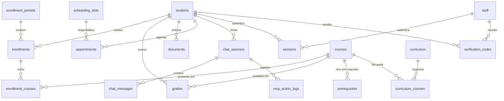

# Schema do Banco de Dados

## ERD - Diagrama Entidade-Relacionamento



---

## Tabelas

### `students` - Alunos

| Coluna | Tipo | Constraints | Descricao |
|--------|------|-------------|-----------|
| id | UUID | PK | Identificador unico |
| name | VARCHAR(255) | NOT NULL | Nome completo |
| email | VARCHAR(255) | UNIQUE, NOT NULL | Email institucional |
| phone | VARCHAR(20) | UNIQUE | Telefone (WhatsApp) |
| registration_number | VARCHAR(20) | UNIQUE, NOT NULL | Numero de matricula |
| semester | INTEGER | NOT NULL, DEFAULT 1 | Periodo atual (1-8) |
| status | VARCHAR(20) | NOT NULL, DEFAULT 'active' | active, inactive, graduated, locked |
| enrollment_year | INTEGER | NOT NULL | Ano de ingresso |
| curriculum_id | UUID | FK -> curriculum.id | Curriculo que o aluno segue |
| fcm_token | VARCHAR(255) | | Token FCM para push notifications |
| created_at | TIMESTAMP | NOT NULL, DEFAULT NOW() | |
| updated_at | TIMESTAMP | NOT NULL, DEFAULT NOW() | |

### `staff` - Funcionarios/Fornecedores

| Coluna | Tipo | Constraints | Descricao |
|--------|------|-------------|-----------|
| id | UUID | PK | Identificador unico |
| name | VARCHAR(255) | NOT NULL | Nome completo |
| email | VARCHAR(255) | UNIQUE, NOT NULL | Email |
| phone | VARCHAR(20) | | Telefone |
| role | VARCHAR(50) | NOT NULL | admin, coordinator, secretary |
| fcm_token | VARCHAR(255) | | Token FCM |
| created_at | TIMESTAMP | NOT NULL, DEFAULT NOW() | |
| updated_at | TIMESTAMP | NOT NULL, DEFAULT NOW() | |

### `courses` - Disciplinas

| Coluna | Tipo | Constraints | Descricao |
|--------|------|-------------|-----------|
| id | UUID | PK | Identificador unico |
| code | VARCHAR(10) | UNIQUE, NOT NULL | Codigo da disciplina (ex: CC101) |
| name | VARCHAR(255) | NOT NULL | Nome da disciplina |
| credits | INTEGER | NOT NULL | Creditos |
| workload_hours | INTEGER | NOT NULL | Carga horaria |
| description | TEXT | | Ementa |
| created_at | TIMESTAMP | NOT NULL, DEFAULT NOW() | |

### `prerequisites` - Pre-requisitos

| Coluna | Tipo | Constraints | Descricao |
|--------|------|-------------|-----------|
| id | UUID | PK | |
| course_id | UUID | FK -> courses.id, NOT NULL | Disciplina |
| prerequisite_id | UUID | FK -> courses.id, NOT NULL | Pre-requisito |
| UNIQUE | | (course_id, prerequisite_id) | |

### `curriculum` - Curriculo

| Coluna | Tipo | Constraints | Descricao |
|--------|------|-------------|-----------|
| id | UUID | PK | |
| name | VARCHAR(100) | NOT NULL | Ex: "CC 2024.1" |
| year | INTEGER | NOT NULL | Ano de vigencia |
| is_active | BOOLEAN | NOT NULL, DEFAULT true | Curriculo vigente |
| created_at | TIMESTAMP | NOT NULL, DEFAULT NOW() | |

### `curriculum_courses` - Disciplinas do Curriculo

| Coluna | Tipo | Constraints | Descricao |
|--------|------|-------------|-----------|
| id | UUID | PK | |
| curriculum_id | UUID | FK -> curriculum.id, NOT NULL | |
| course_id | UUID | FK -> courses.id, NOT NULL | |
| semester | INTEGER | NOT NULL | Periodo recomendado (1-8) |
| is_required | BOOLEAN | NOT NULL, DEFAULT true | Obrigatoria ou eletiva |
| UNIQUE | | (curriculum_id, course_id) | |

---

### `enrollment_periods` - Periodos de Matricula

| Coluna | Tipo | Constraints | Descricao |
|--------|------|-------------|-----------|
| id | UUID | PK | |
| name | VARCHAR(100) | NOT NULL | Ex: "2025.1 - Matricula" |
| type | VARCHAR(20) | NOT NULL | enrollment, re_enrollment |
| start_date | DATE | NOT NULL | Inicio do periodo |
| end_date | DATE | NOT NULL | Fim do periodo |
| semester_year | VARCHAR(10) | NOT NULL | Ex: "2025.1" |
| is_active | BOOLEAN | NOT NULL, DEFAULT false | |
| created_at | TIMESTAMP | NOT NULL, DEFAULT NOW() | |

### `enrollments` - Matriculas

| Coluna | Tipo | Constraints | Descricao |
|--------|------|-------------|-----------|
| id | UUID | PK | |
| student_id | UUID | FK -> students.id, NOT NULL | |
| enrollment_period_id | UUID | FK -> enrollment_periods.id, NOT NULL | |
| status | VARCHAR(20) | NOT NULL, DEFAULT 'draft' | draft, confirmed, cancelled |
| created_at | TIMESTAMP | NOT NULL, DEFAULT NOW() | |
| confirmed_at | TIMESTAMP | | Quando foi confirmada |

### `enrollment_courses` - Disciplinas da Matricula

| Coluna | Tipo | Constraints | Descricao |
|--------|------|-------------|-----------|
| id | UUID | PK | |
| enrollment_id | UUID | FK -> enrollments.id, NOT NULL | |
| course_id | UUID | FK -> courses.id, NOT NULL | |
| status | VARCHAR(20) | NOT NULL, DEFAULT 'enrolled' | enrolled, dropped, locked |
| UNIQUE | | (enrollment_id, course_id) | |

---

### `grades` - Notas

| Coluna | Tipo | Constraints | Descricao |
|--------|------|-------------|-----------|
| id | UUID | PK | |
| student_id | UUID | FK -> students.id, NOT NULL | |
| course_id | UUID | FK -> courses.id, NOT NULL | |
| semester_year | VARCHAR(10) | NOT NULL | Ex: "2025.1" |
| grade_1 | DECIMAL(4,2) | | Nota 1 |
| grade_2 | DECIMAL(4,2) | | Nota 2 |
| grade_final | DECIMAL(4,2) | | Nota final |
| status | VARCHAR(20) | NOT NULL, DEFAULT 'in_progress' | in_progress, approved, failed, locked |
| created_at | TIMESTAMP | NOT NULL, DEFAULT NOW() | |
| updated_at | TIMESTAMP | NOT NULL, DEFAULT NOW() | |

---

### `documents` - Documentos

| Coluna | Tipo | Constraints | Descricao |
|--------|------|-------------|-----------|
| id | UUID | PK | |
| student_id | UUID | FK -> students.id, NOT NULL | |
| type | VARCHAR(50) | NOT NULL | transcript, enrollment_proof, declaration, certificate |
| status | VARCHAR(20) | NOT NULL, DEFAULT 'requested' | requested, processing, ready, delivered |
| file_url | VARCHAR(500) | | URL do documento gerado |
| requested_at | TIMESTAMP | NOT NULL, DEFAULT NOW() | |
| completed_at | TIMESTAMP | | |

---

### `scheduling_slots` - Slots de Agendamento

| Coluna | Tipo | Constraints | Descricao |
|--------|------|-------------|-----------|
| id | UUID | PK | |
| staff_id | UUID | FK -> staff.id, NOT NULL | Responsavel |
| date | DATE | NOT NULL | |
| start_time | TIME | NOT NULL | |
| end_time | TIME | NOT NULL | |
| is_available | BOOLEAN | NOT NULL, DEFAULT true | |
| created_at | TIMESTAMP | NOT NULL, DEFAULT NOW() | |

### `appointments` - Agendamentos

| Coluna | Tipo | Constraints | Descricao |
|--------|------|-------------|-----------|
| id | UUID | PK | |
| student_id | UUID | FK -> students.id, NOT NULL | |
| slot_id | UUID | FK -> scheduling_slots.id, NOT NULL | |
| reason | TEXT | NOT NULL | Motivo do agendamento |
| status | VARCHAR(20) | NOT NULL, DEFAULT 'scheduled' | scheduled, completed, cancelled, no_show |
| created_at | TIMESTAMP | NOT NULL, DEFAULT NOW() | |

---

### `verification_codes` - Codigos de Verificacao

| Coluna | Tipo | Constraints | Descricao |
|--------|------|-------------|-----------|
| id | UUID | PK | |
| email | VARCHAR(255) | NOT NULL | Email destino |
| code | VARCHAR(6) | NOT NULL | Codigo de 6 digitos |
| channel | VARCHAR(10) | NOT NULL | email, sms |
| expires_at | TIMESTAMP | NOT NULL | Expira em 5 minutos |
| used | BOOLEAN | NOT NULL, DEFAULT false | |
| created_at | TIMESTAMP | NOT NULL, DEFAULT NOW() | |

### `sessions` - Sessoes Autenticadas

| Coluna | Tipo | Constraints | Descricao |
|--------|------|-------------|-----------|
| id | UUID | PK | |
| user_id | UUID | NOT NULL | ID do student ou staff |
| user_type | VARCHAR(10) | NOT NULL | student, staff |
| token | VARCHAR(500) | UNIQUE, NOT NULL | JWT token |
| platform | VARCHAR(20) | NOT NULL | whatsapp, app |
| expires_at | TIMESTAMP | NOT NULL | |
| created_at | TIMESTAMP | NOT NULL, DEFAULT NOW() | |

---

### `chat_sessions` - Sessoes de Chat

| Coluna | Tipo | Constraints | Descricao |
|--------|------|-------------|-----------|
| id | UUID | PK | |
| student_id | UUID | FK -> students.id, NOT NULL | |
| whatsapp_phone | VARCHAR(20) | NOT NULL | Numero do WhatsApp |
| status | VARCHAR(20) | NOT NULL, DEFAULT 'active' | active, closed |
| started_at | TIMESTAMP | NOT NULL, DEFAULT NOW() | |
| ended_at | TIMESTAMP | | |

### `chat_messages` - Mensagens do Chat

| Coluna | Tipo | Constraints | Descricao |
|--------|------|-------------|-----------|
| id | UUID | PK | |
| chat_session_id | UUID | FK -> chat_sessions.id, NOT NULL | |
| role | VARCHAR(10) | NOT NULL | user, assistant, system |
| content | TEXT | NOT NULL | Conteudo da mensagem |
| whatsapp_message_id | VARCHAR(100) | | ID da mensagem no WhatsApp |
| created_at | TIMESTAMP | NOT NULL, DEFAULT NOW() | |

### `mcp_action_logs` - Log de Acoes MCP

| Coluna | Tipo | Constraints | Descricao |
|--------|------|-------------|-----------|
| id | UUID | PK | |
| chat_session_id | UUID | FK -> chat_sessions.id, NOT NULL | |
| tool_name | VARCHAR(100) | NOT NULL | Nome da tool MCP chamada |
| input_params | JSONB | NOT NULL | Parametros de entrada |
| output_result | JSONB | | Resultado retornado |
| reasoning | TEXT | | Raciocinio do agente para usar a tool |
| latency_ms | INTEGER | | Tempo de execucao em ms |
| status | VARCHAR(20) | NOT NULL | success, error |
| created_at | TIMESTAMP | NOT NULL, DEFAULT NOW() | |

---

## Indices Recomendados

```sql
-- Busca rapida por aluno
CREATE INDEX idx_students_email ON students(email);
CREATE INDEX idx_students_phone ON students(phone);
CREATE INDEX idx_students_registration ON students(registration_number);

-- Grades por aluno e periodo
CREATE INDEX idx_grades_student_semester ON grades(student_id, semester_year);

-- Matriculas ativas
CREATE INDEX idx_enrollments_student ON enrollments(student_id, status);

-- Documentos por aluno
CREATE INDEX idx_documents_student ON documents(student_id, status);

-- Chat sessions ativas
CREATE INDEX idx_chat_sessions_student ON chat_sessions(student_id, status);

-- Logs MCP por sessao
CREATE INDEX idx_mcp_logs_session ON mcp_action_logs(chat_session_id, created_at);

-- Verificacao de codigos
CREATE INDEX idx_verification_codes_email ON verification_codes(email, used, expires_at);

-- Sessoes ativas
CREATE INDEX idx_sessions_token ON sessions(token, expires_at);
```

---

## Seed Data - Curriculo de Ciencia da Computacao (8 Periodos)

O curriculo base deve conter disciplinas distribuidas em 8 periodos. Exemplo de estrutura:

| Periodo | Disciplinas (exemplo) |
|---------|----------------------|
| 1 | Introducao a Computacao, Calculo I, Logica Matematica, Algoritmos e Programacao |
| 2 | Estrutura de Dados, Calculo II, Algebra Linear, Programacao Orientada a Objetos |
| 3 | Banco de Dados I, Calculo III, Arquitetura de Computadores, Teoria dos Grafos |
| 4 | Engenharia de Software, Redes de Computadores, Sistemas Operacionais, Estatistica |
| 5 | Compiladores, Banco de Dados II, Inteligencia Artificial, Computacao Grafica |
| 6 | Sistemas Distribuidos, Seguranca da Informacao, Aprendizado de Maquina, Eletiva I |
| 7 | Projeto de Software, Processamento de Linguagem Natural, Eletiva II, Eletiva III |
| 8 | TCC, Estagio Supervisionado, Eletiva IV |
