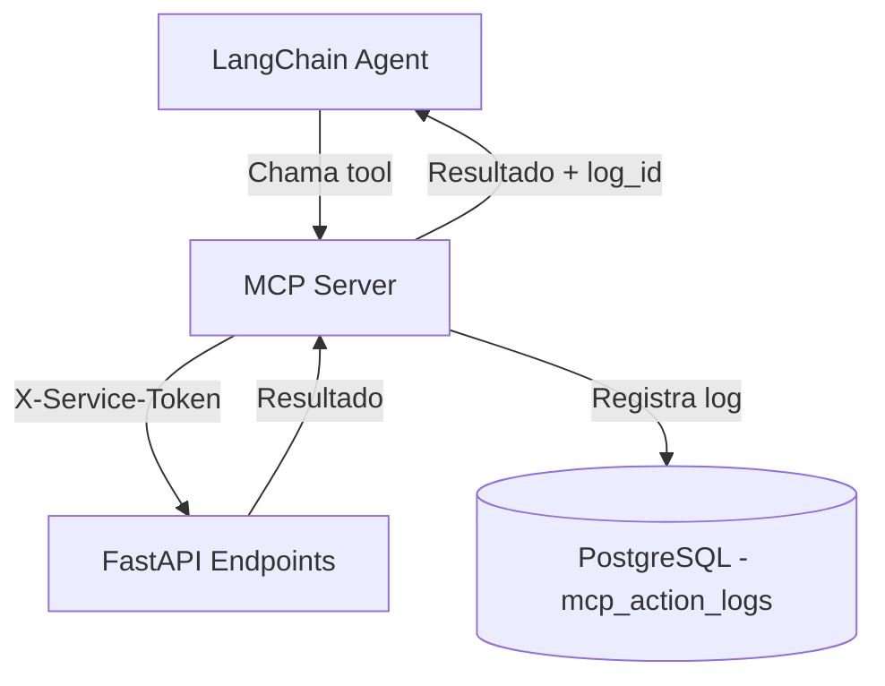
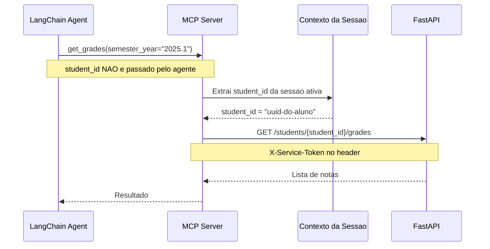

# MCP - Model Context Protocol

## Visao Geral

O MCP Server tem **dual purpose** neste sistema:

1. **Tool Calling**: O agente LangChain usa MCP tools para executar acoes na API (consultar notas, matricular, etc)
2. **Logging**: Toda chamada de tool e registrada com parametros, resultado, latencia e raciocinio do agente



---

## Autenticacao MCP → API (Service Token)

O MCP Server autentica todas as chamadas internas para a API usando um **Service Token fixo**,
enviado no header `X-Service-Token`. A API valida esse token em um middleware dedicado antes de
processar qualquer requisicao interna.

```
X-Service-Token: {MCP_SERVICE_TOKEN}
```

**Regras de segurança:**

- O token vive exclusivamente como variavel de ambiente (`MCP_SERVICE_TOKEN`) no `docker-compose.yml`
- O token **nunca** entra no codigo-fonte nem em arquivos versionados no git
- Adicionar `MCP_SERVICE_TOKEN` ao `.gitignore` via `.env`
- O endpoint valida: se `X-Service-Token` ausente ou invalido → `401 Unauthorized`

```python
# FastAPI — middleware de validacao do Service Token
async def verify_service_token(request: Request, call_next):
    service_token = request.headers.get("X-Service-Token")
    if service_token != settings.MCP_SERVICE_TOKEN:
        return JSONResponse(status_code=401, content={"detail": "Unauthorized"})
    return await call_next(request)
```

---

## Injecao de `student_id` pelo Contexto da Sessao

O `student_id` **nunca aparece como parametro nos schemas das tools expostos ao agente**.
O MCP extrai o ID do aluno da sessao autenticada ativa e o injeta internamente antes de
chamar a API. Isso elimina qualquer risco de IDOR (Insecure Direct Object Reference).



**Consequencia para os schemas:** Todos os schemas de tools que operam sobre dados do aluno
**omitem** `student_id` da lista de parametros. O campo e injetado internamente pelo MCP.
Tools que operam sobre recursos especificos (ex: `enrollment_id`, `document_id`) continuam
recebendo esses IDs normalmente, pois sao retornados pelo proprio sistema em chamadas anteriores.

---

## Comportamento de Retry

Em caso de falha na chamada a API (erro 5xx ou timeout), o MCP realiza **uma unica retentativa
imediata** antes de registrar o erro no log e retornar falha ao agente.

```
Tentativa 1 → falha (5xx / timeout)
     ↓
Tentativa 2 (imediata, sem espera)
     ↓ sucesso → retorna resultado normalmente
     ↓ falha   → registra status="error" no log, retorna erro ao agente
```

O agente recebe a mensagem de erro e decide o que comunicar ao aluno (ver tabela de erros
no `chatbot.md`). Erros 4xx (400, 401, 404, 422) **nao geram retry** — sao falhas de
logica que uma segunda tentativa nao resolveria.

---

## Extracao de `reasoning` via Callback Handler

O campo `reasoning` do log e capturado por um `BaseCallbackHandler` do LangChain que
intercepta o evento `on_tool_start`. Nesse momento, o handler tem acesso ao estado
intermediario do agente (chain-of-thought) antes da execucao da tool.

```python
from langchain.callbacks.base import BaseCallbackHandler

class MCPLoggingHandler(BaseCallbackHandler):
    def on_tool_start(self, serialized: dict, input_str: str, **kwargs):
        # Captura o pensamento intermediario do agente
        agent_action = kwargs.get("run_manager") or {}
        self.current_reasoning = kwargs.get("tags", [None])[0] or input_str

    def on_tool_end(self, output: str, **kwargs):
        # Reasoning ja disponivel para o middleware de log
        pass
```

> **Nota:** O campo `reasoning` e `nullable`. Se o modelo nao expuser o chain-of-thought
> (ex: modelos sem suporte a ReAct explicito), o campo e salvo como `null` no log —
> nao e um erro, e comportamento esperado.

---

## Definicao de Tools

> **Nota de implementacao:** `student_id` foi removido dos schemas de todas as tools que
> operam sobre dados do aluno autenticado. O MCP injeta esse valor internamente a partir
> do contexto da sessao. Veja a secao "Injecao de student_id" acima.

### `get_student_info`

Retorna resumo academico do aluno autenticado.

| Campo          | Valor                                              |
| -------------- | -------------------------------------------------- |
| **Endpoint**   | `GET /api/v1/students/{id}/academic-summary`       |
| **Parametros** | _(student_id injetado pela sessao)_                |
| **Retorno**    | Nome, periodo, disciplinas concluidas, CRA, status |

```json
{
  "name": "get_student_info",
  "description": "Retorna o resumo academico do aluno autenticado: nome, periodo, disciplinas concluidas, CRA e status.",
  "inputSchema": {
    "type": "object",
    "properties": {}
  }
}
```

---

### `get_grades`

Consulta notas do aluno por periodo.

| Campo          | Valor                                                            |
| -------------- | ---------------------------------------------------------------- |
| **Endpoint**   | `GET /api/v1/students/{id}/grades`                               |
| **Parametros** | `semester_year` (optional) — _(student_id injetado pela sessao)_ |
| **Retorno**    | Lista de notas com disciplina, N1, N2, final, status             |

```json
{
  "name": "get_grades",
  "description": "Consulta notas do aluno. Se semester_year nao for informado, retorna do periodo atual.",
  "inputSchema": {
    "type": "object",
    "properties": {
      "semester_year": {
        "type": "string",
        "description": "Ex: 2025.1. Omitir para periodo atual."
      }
    }
  }
}
```

---

### `get_transcript`

Historico escolar completo.

| Campo          | Valor                                               |
| -------------- | --------------------------------------------------- |
| **Endpoint**   | `GET /api/v1/students/{id}/transcript`              |
| **Parametros** | _(student_id injetado pela sessao)_                 |
| **Retorno**    | Historico completo com todas as disciplinas e notas |

```json
{
  "name": "get_transcript",
  "description": "Retorna o historico escolar completo do aluno autenticado.",
  "inputSchema": {
    "type": "object",
    "properties": {}
  }
}
```

---

### `get_available_courses`

Disciplinas disponiveis para matricula (respeitando pre-requisitos).

| Campo          | Valor                                             |
| -------------- | ------------------------------------------------- |
| **Endpoint**   | `GET /api/v1/students/{id}/available-courses`     |
| **Parametros** | _(student_id injetado pela sessao)_               |
| **Retorno**    | Lista de disciplinas com pre-requisitos atendidos |

```json
{
  "name": "get_available_courses",
  "description": "Lista disciplinas disponiveis para matricula do aluno, considerando pre-requisitos.",
  "inputSchema": {
    "type": "object",
    "properties": {}
  }
}
```

---

### `create_enrollment`

Cria matricula com disciplinas selecionadas (status: draft).

| Campo          | Valor                                                                                 |
| -------------- | ------------------------------------------------------------------------------------- |
| **Endpoint**   | `POST /api/v1/enrollments`                                                            |
| **Parametros** | `enrollment_period_id`, `course_ids` (required) — _(student_id injetado pela sessao)_ |
| **Retorno**    | Matricula criada com status draft e enrollment_id                                     |

```json
{
  "name": "create_enrollment",
  "description": "Cria uma matricula (rascunho) com as disciplinas selecionadas. O aluno deve confirmar com confirm_enrollment depois.",
  "inputSchema": {
    "type": "object",
    "properties": {
      "enrollment_period_id": {
        "type": "string",
        "description": "UUID do periodo de matricula ativo"
      },
      "course_ids": {
        "type": "array",
        "items": { "type": "string" },
        "description": "Lista de UUIDs das disciplinas"
      }
    },
    "required": ["enrollment_period_id", "course_ids"]
  }
}
```

---

### `confirm_enrollment`

Confirma uma matricula em rascunho (draft → confirmed).

| Campo               | Valor                                                                    |
| ------------------- | ------------------------------------------------------------------------ |
| **Endpoint**        | `POST /api/v1/enrollments/{id}/confirm`                                  |
| **Parametros**      | `enrollment_id` (required)                                               |
| **Retorno**         | Matricula confirmada definitivamente                                     |
| **Erros possiveis** | `409` se periodo de matricula encerrado; `404` se enrollment_id invalido |

```json
{
  "name": "confirm_enrollment",
  "description": "Confirma definitivamente uma matricula em rascunho. Deve ser chamada apos create_enrollment e confirmacao explicita do aluno.",
  "inputSchema": {
    "type": "object",
    "properties": {
      "enrollment_id": {
        "type": "string",
        "description": "UUID da matricula em status draft"
      }
    },
    "required": ["enrollment_id"]
  }
}
```

---

### `drop_course`

Remove disciplina da matricula.

| Campo          | Valor                                                 |
| -------------- | ----------------------------------------------------- |
| **Endpoint**   | `DELETE /api/v1/enrollments/{id}/courses/{course_id}` |
| **Parametros** | `enrollment_id`, `course_id` (required)               |
| **Retorno**    | Confirmacao da remocao                                |

```json
{
  "name": "drop_course",
  "description": "Remove uma disciplina da matricula do aluno.",
  "inputSchema": {
    "type": "object",
    "properties": {
      "enrollment_id": { "type": "string" },
      "course_id": { "type": "string" }
    },
    "required": ["enrollment_id", "course_id"]
  }
}
```

---

### `lock_enrollment`

Tranca a matricula inteira.

| Campo          | Valor                                |
| -------------- | ------------------------------------ |
| **Endpoint**   | `POST /api/v1/enrollments/{id}/lock` |
| **Parametros** | `enrollment_id` (required)           |
| **Retorno**    | Confirmacao do trancamento           |

```json
{
  "name": "lock_enrollment",
  "description": "Tranca a matricula inteira do aluno no periodo.",
  "inputSchema": {
    "type": "object",
    "properties": {
      "enrollment_id": { "type": "string" }
    },
    "required": ["enrollment_id"]
  }
}
```

---

### `request_document`

Solicita emissao de documento.

| Campo          | Valor                                                   |
| -------------- | ------------------------------------------------------- |
| **Endpoint**   | `POST /api/v1/documents`                                |
| **Parametros** | `type` (required) — _(student_id injetado pela sessao)_ |
| **Retorno**    | Documento solicitado com status e previsao              |

```json
{
  "name": "request_document",
  "description": "Solicita a emissao de um documento academico. Tipos: transcript, enrollment_proof, declaration, certificate.",
  "inputSchema": {
    "type": "object",
    "properties": {
      "type": {
        "type": "string",
        "enum": ["transcript", "enrollment_proof", "declaration", "certificate"]
      }
    },
    "required": ["type"]
  }
}
```

---

### `get_document_status`

Verifica status de um documento solicitado.

| Campo          | Valor                          |
| -------------- | ------------------------------ |
| **Endpoint**   | `GET /api/v1/documents/{id}`   |
| **Parametros** | `document_id` (required)       |
| **Retorno**    | Status atual e URL (se pronto) |

```json
{
  "name": "get_document_status",
  "description": "Verifica o status de um documento solicitado.",
  "inputSchema": {
    "type": "object",
    "properties": {
      "document_id": { "type": "string" }
    },
    "required": ["document_id"]
  }
}
```

---

### `get_available_slots`

Lista horarios disponiveis para agendamento.

| Campo          | Valor                                          |
| -------------- | ---------------------------------------------- |
| **Endpoint**   | `GET /api/v1/scheduling/slots`                 |
| **Parametros** | `date_from` (optional), `date_to` (optional)   |
| **Retorno**    | Lista de slots com data, horario e responsavel |

```json
{
  "name": "get_available_slots",
  "description": "Lista horarios de atendimento disponiveis na secretaria.",
  "inputSchema": {
    "type": "object",
    "properties": {
      "date_from": {
        "type": "string",
        "format": "date",
        "description": "Data inicial (YYYY-MM-DD). Padrao: hoje."
      },
      "date_to": {
        "type": "string",
        "format": "date",
        "description": "Data final (YYYY-MM-DD). Padrao: +7 dias."
      }
    }
  }
}
```

---

### `book_appointment`

Agenda atendimento presencial.

| Campo          | Valor                                                                |
| -------------- | -------------------------------------------------------------------- |
| **Endpoint**   | `POST /api/v1/appointments`                                          |
| **Parametros** | `slot_id`, `reason` (required) — _(student_id injetado pela sessao)_ |
| **Retorno**    | Agendamento confirmado com detalhes                                  |

```json
{
  "name": "book_appointment",
  "description": "Agenda um atendimento presencial na secretaria.",
  "inputSchema": {
    "type": "object",
    "properties": {
      "slot_id": { "type": "string" },
      "reason": { "type": "string", "description": "Motivo do atendimento" }
    },
    "required": ["slot_id", "reason"]
  }
}
```

---

### `cancel_appointment`

Cancela agendamento.

| Campo          | Valor                                  |
| -------------- | -------------------------------------- |
| **Endpoint**   | `PUT /api/v1/appointments/{id}/cancel` |
| **Parametros** | `appointment_id` (required)            |
| **Retorno**    | Confirmacao do cancelamento            |

```json
{
  "name": "cancel_appointment",
  "description": "Cancela um agendamento de atendimento.",
  "inputSchema": {
    "type": "object",
    "properties": {
      "appointment_id": { "type": "string" }
    },
    "required": ["appointment_id"]
  }
}
```

---

### `get_curriculum`

Retorna grade curricular vigente.

| Campo          | Valor                                             |
| -------------- | ------------------------------------------------- |
| **Endpoint**   | `GET /api/v1/curriculum/active`                   |
| **Parametros** | Nenhum                                            |
| **Retorno**    | Curriculo com disciplinas organizadas por periodo |

```json
{
  "name": "get_curriculum",
  "description": "Retorna a grade curricular vigente do curso de Ciencia da Computacao.",
  "inputSchema": {
    "type": "object",
    "properties": {}
  }
}
```

---

### `get_course_prerequisites`

Arvore de pre-requisitos de uma disciplina.

| Campo          | Valor                                    |
| -------------- | ---------------------------------------- |
| **Endpoint**   | `GET /api/v1/courses/{id}/prerequisites` |
| **Parametros** | `course_id` (required)                   |
| **Retorno**    | Arvore de pre-requisitos                 |

```json
{
  "name": "get_course_prerequisites",
  "description": "Retorna os pre-requisitos de uma disciplina.",
  "inputSchema": {
    "type": "object",
    "properties": {
      "course_id": { "type": "string" }
    },
    "required": ["course_id"]
  }
}
```

---

### `get_enrollment_period`

Retorna periodo de matricula atual.

| Campo          | Valor                                    |
| -------------- | ---------------------------------------- |
| **Endpoint**   | `GET /api/v1/enrollment-periods/current` |
| **Parametros** | Nenhum                                   |
| **Retorno**    | Periodo ativo com datas de inicio e fim  |

```json
{
  "name": "get_enrollment_period",
  "description": "Retorna informacoes sobre o periodo de matricula atual (se houver).",
  "inputSchema": {
    "type": "object",
    "properties": {}
  }
}
```

---

## Tabela Resumo de Tools

| Tool                       | Endpoint                              | student_id | Requer confirmacao do aluno |
| -------------------------- | ------------------------------------- | ---------- | --------------------------- |
| `get_student_info`         | GET /students/{id}/academic-summary   | injetado   | Nao                         |
| `get_grades`               | GET /students/{id}/grades             | injetado   | Nao                         |
| `get_transcript`           | GET /students/{id}/transcript         | injetado   | Nao                         |
| `get_available_courses`    | GET /students/{id}/available-courses  | injetado   | Nao                         |
| `create_enrollment`        | POST /enrollments                     | injetado   | Sim (antes de chamar)       |
| `confirm_enrollment`       | POST /enrollments/{id}/confirm        | —          | Sim (antes de chamar)       |
| `drop_course`              | DELETE /enrollments/{id}/courses/{id} | —          | Sim (antes de chamar)       |
| `lock_enrollment`          | POST /enrollments/{id}/lock           | —          | Sim (antes de chamar)       |
| `request_document`         | POST /documents                       | injetado   | Sim (antes de chamar)       |
| `get_document_status`      | GET /documents/{id}                   | —          | Nao                         |
| `get_available_slots`      | GET /scheduling/slots                 | —          | Nao                         |
| `book_appointment`         | POST /appointments                    | injetado   | Sim (antes de chamar)       |
| `cancel_appointment`       | PUT /appointments/{id}/cancel         | —          | Sim (antes de chamar)       |
| `get_curriculum`           | GET /curriculum/active                | —          | Nao                         |
| `get_course_prerequisites` | GET /courses/{id}/prerequisites       | —          | Nao                         |
| `get_enrollment_period`    | GET /enrollment-periods/current       | —          | Nao                         |

---

## Especificacao de Logging

Toda chamada de tool MCP gera um registro em `mcp_action_logs`:

```json
{
  "id": "uuid",
  "chat_session_id": "uuid",
  "tool_name": "get_grades",
  "input_params": {
    "semester_year": "2025.1"
  },
  "output_result": {
    "data": [
      { "course": "Algoritmos", "grade_final": 7.75, "status": "approved" }
    ]
  },
  "reasoning": "O aluno perguntou sobre suas notas do periodo atual. Usando get_grades para consultar.",
  "latency_ms": 120,
  "status": "success",
  "created_at": "2025-01-20T10:30:00Z"
}
```

> **Nota:** `student_id` foi removido de `input_params` no log — ele e injetado internamente
> e nao precisa ser persistido como parametro de entrada da tool.

### Campos do Log

| Campo           | Tipo    | Nullable | Descricao                                            |
| --------------- | ------- | -------- | ---------------------------------------------------- |
| chat_session_id | UUID    | Nao      | Sessao de chat onde a tool foi chamada               |
| tool_name       | string  | Nao      | Nome da MCP tool executada                           |
| input_params    | JSONB   | Nao      | Parametros enviados pelo agente (sem student_id)     |
| output_result   | JSONB   | Sim      | Resultado retornado (null se status=error)           |
| reasoning       | string  | **Sim**  | Chain-of-thought do agente; null se modelo nao expoe |
| latency_ms      | integer | Nao      | Tempo total de execucao em milissegundos             |
| status          | string  | Nao      | `success`, `error` ou `retry_success`                |
| retry           | boolean | Nao      | `true` se o resultado veio da segunda tentativa      |

---

## Configuracao do MCP Server

### Transporte

O MCP Server usa **stdio** para comunicacao local com o agente LangChain, ou
**SSE (Server-Sent Events)** para comunicacao via rede.

### Registro de Tools

```python
from mcp.server import Server
from mcp.types import Tool

server = Server("academic-mcp")

@server.tool("get_grades")
async def get_grades(semester_year: str = None):
    """Consulta notas do aluno autenticado."""
    student_id = session_context.get_student_id()  # injetado da sessao
    response = await api_client.get(
        f"/students/{student_id}/grades",
        params={"semester_year": semester_year},
        headers={"X-Service-Token": settings.MCP_SERVICE_TOKEN}
    )
    return response.json()
```

### Middleware de Logging com Retry

```python
async def execute_tool_with_middleware(tool_name: str, func, *args, **kwargs):
    start = time.monotonic()
    retry = False
    try:
        result = await func(*args, **kwargs)
    except (httpx.HTTPStatusError, httpx.TimeoutException) as e:
        if isinstance(e, httpx.HTTPStatusError) and e.response.status_code < 500:
            raise  # 4xx nao faz retry
        retry = True
        result = await func(*args, **kwargs)  # segunda tentativa imediata
    latency_ms = int((time.monotonic() - start) * 1000)
    await log_action(tool_name, args, result, latency_ms, retry=retry)
    return result
```

### Callback Handler para `reasoning`

```python
from langchain.callbacks.base import BaseCallbackHandler

class MCPLoggingHandler(BaseCallbackHandler):
    def __init__(self):
        self.current_reasoning: str | None = None

    def on_agent_action(self, action, **kwargs):
        # Captura o log do agente antes de chamar a tool
        self.current_reasoning = getattr(action, "log", None)

    def on_tool_end(self, output: str, **kwargs):
        # reasoning disponivel para o middleware de log via self.current_reasoning
        pass
```

> **Nota:** `on_agent_action` e o evento correto para capturar o chain-of-thought no
> LangChain ReAct — ele dispara antes do `on_tool_start` e contem o `log` com o
> pensamento intermediario do agente. O campo e `nullable` se o modelo nao o expuser.
