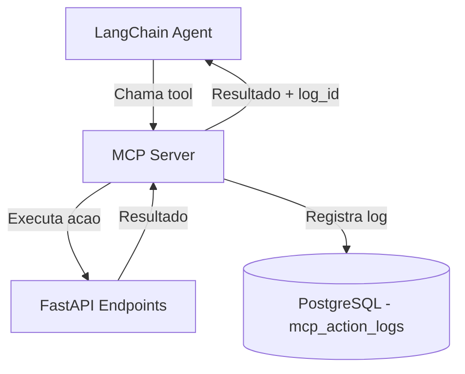

# MCP - Model Context Protocol

## Visao Geral

O MCP Server tem **dual purpose** neste sistema:

1. **Tool Calling**: O agente LangChain usa MCP tools para executar acoes na API (consultar notas, matricular, etc)
2. **Logging**: Toda chamada de tool e registrada com parametros, resultado, latencia e raciocinio do agente



---

## Definicao de Tools

### `get_student_info`
Retorna resumo academico do aluno autenticado.

| Campo | Valor |
|-------|-------|
| **Endpoint** | `GET /api/v1/students/{id}/academic-summary` |
| **Parametros** | `student_id` (string, required) |
| **Retorno** | Nome, periodo, disciplinas concluidas, CRA, status |

```json
{
  "name": "get_student_info",
  "description": "Retorna o resumo academico do aluno: nome, periodo, disciplinas concluidas, CRA e status.",
  "inputSchema": {
    "type": "object",
    "properties": {
      "student_id": {"type": "string", "description": "UUID do aluno"}
    },
    "required": ["student_id"]
  }
}
```

---

### `get_grades`
Consulta notas do aluno por periodo.

| Campo | Valor |
|-------|-------|
| **Endpoint** | `GET /api/v1/students/{id}/grades` |
| **Parametros** | `student_id` (required), `semester_year` (optional) |
| **Retorno** | Lista de notas com disciplina, N1, N2, final, status |

```json
{
  "name": "get_grades",
  "description": "Consulta notas do aluno. Se semester_year nao for informado, retorna do periodo atual.",
  "inputSchema": {
    "type": "object",
    "properties": {
      "student_id": {"type": "string"},
      "semester_year": {"type": "string", "description": "Ex: 2025.1"}
    },
    "required": ["student_id"]
  }
}
```

---

### `get_transcript`
Historico escolar completo.

| Campo | Valor |
|-------|-------|
| **Endpoint** | `GET /api/v1/students/{id}/transcript` |
| **Parametros** | `student_id` (required) |
| **Retorno** | Historico completo com todas as disciplinas e notas |

```json
{
  "name": "get_transcript",
  "description": "Retorna o historico escolar completo do aluno.",
  "inputSchema": {
    "type": "object",
    "properties": {
      "student_id": {"type": "string"}
    },
    "required": ["student_id"]
  }
}
```

---

### `get_available_courses`
Disciplinas disponiveis para matricula (respeitando pre-requisitos).

| Campo | Valor |
|-------|-------|
| **Endpoint** | `GET /api/v1/students/{id}/available-courses` |
| **Parametros** | `student_id` (required) |
| **Retorno** | Lista de disciplinas com pre-requisitos atendidos |

```json
{
  "name": "get_available_courses",
  "description": "Lista disciplinas disponiveis para matricula do aluno, considerando pre-requisitos.",
  "inputSchema": {
    "type": "object",
    "properties": {
      "student_id": {"type": "string"}
    },
    "required": ["student_id"]
  }
}
```

---

### `create_enrollment`
Cria matricula com disciplinas selecionadas.

| Campo | Valor |
|-------|-------|
| **Endpoint** | `POST /api/v1/enrollments` |
| **Parametros** | `student_id`, `enrollment_period_id`, `course_ids` (required) |
| **Retorno** | Matricula criada com status draft |

```json
{
  "name": "create_enrollment",
  "description": "Cria uma matricula (rascunho) com as disciplinas selecionadas. O aluno deve confirmar depois.",
  "inputSchema": {
    "type": "object",
    "properties": {
      "student_id": {"type": "string"},
      "enrollment_period_id": {"type": "string"},
      "course_ids": {"type": "array", "items": {"type": "string"}}
    },
    "required": ["student_id", "enrollment_period_id", "course_ids"]
  }
}
```

---

### `drop_course`
Remove disciplina da matricula.

| Campo | Valor |
|-------|-------|
| **Endpoint** | `DELETE /api/v1/enrollments/{id}/courses/{course_id}` |
| **Parametros** | `enrollment_id`, `course_id` (required) |
| **Retorno** | Confirmacao da remocao |

```json
{
  "name": "drop_course",
  "description": "Remove uma disciplina da matricula do aluno.",
  "inputSchema": {
    "type": "object",
    "properties": {
      "enrollment_id": {"type": "string"},
      "course_id": {"type": "string"}
    },
    "required": ["enrollment_id", "course_id"]
  }
}
```

---

### `lock_enrollment`
Tranca a matricula inteira.

| Campo | Valor |
|-------|-------|
| **Endpoint** | `POST /api/v1/enrollments/{id}/lock` |
| **Parametros** | `enrollment_id` (required) |
| **Retorno** | Confirmacao do trancamento |

```json
{
  "name": "lock_enrollment",
  "description": "Tranca a matricula inteira do aluno no periodo.",
  "inputSchema": {
    "type": "object",
    "properties": {
      "enrollment_id": {"type": "string"}
    },
    "required": ["enrollment_id"]
  }
}
```

---

### `request_document`
Solicita emissao de documento.

| Campo | Valor |
|-------|-------|
| **Endpoint** | `POST /api/v1/documents` |
| **Parametros** | `student_id`, `type` (required) |
| **Retorno** | Documento solicitado com status e previsao |

```json
{
  "name": "request_document",
  "description": "Solicita a emissao de um documento academico. Tipos: transcript, enrollment_proof, declaration, certificate.",
  "inputSchema": {
    "type": "object",
    "properties": {
      "student_id": {"type": "string"},
      "type": {"type": "string", "enum": ["transcript", "enrollment_proof", "declaration", "certificate"]}
    },
    "required": ["student_id", "type"]
  }
}
```

---

### `get_document_status`
Verifica status de um documento solicitado.

| Campo | Valor |
|-------|-------|
| **Endpoint** | `GET /api/v1/documents/{id}` |
| **Parametros** | `document_id` (required) |
| **Retorno** | Status atual e URL (se pronto) |

```json
{
  "name": "get_document_status",
  "description": "Verifica o status de um documento solicitado.",
  "inputSchema": {
    "type": "object",
    "properties": {
      "document_id": {"type": "string"}
    },
    "required": ["document_id"]
  }
}
```

---

### `get_available_slots`
Lista horarios disponiveis para agendamento.

| Campo | Valor |
|-------|-------|
| **Endpoint** | `GET /api/v1/scheduling/slots` |
| **Parametros** | `date_from` (optional), `date_to` (optional) |
| **Retorno** | Lista de slots com data, horario e responsavel |

```json
{
  "name": "get_available_slots",
  "description": "Lista horarios de atendimento disponiveis na secretaria.",
  "inputSchema": {
    "type": "object",
    "properties": {
      "date_from": {"type": "string", "format": "date"},
      "date_to": {"type": "string", "format": "date"}
    }
  }
}
```

---

### `book_appointment`
Agenda atendimento presencial.

| Campo | Valor |
|-------|-------|
| **Endpoint** | `POST /api/v1/appointments` |
| **Parametros** | `student_id`, `slot_id`, `reason` (required) |
| **Retorno** | Agendamento confirmado com detalhes |

```json
{
  "name": "book_appointment",
  "description": "Agenda um atendimento presencial na secretaria.",
  "inputSchema": {
    "type": "object",
    "properties": {
      "student_id": {"type": "string"},
      "slot_id": {"type": "string"},
      "reason": {"type": "string", "description": "Motivo do atendimento"}
    },
    "required": ["student_id", "slot_id", "reason"]
  }
}
```

---

### `cancel_appointment`
Cancela agendamento.

| Campo | Valor |
|-------|-------|
| **Endpoint** | `PUT /api/v1/appointments/{id}/cancel` |
| **Parametros** | `appointment_id` (required) |
| **Retorno** | Confirmacao do cancelamento |

```json
{
  "name": "cancel_appointment",
  "description": "Cancela um agendamento de atendimento.",
  "inputSchema": {
    "type": "object",
    "properties": {
      "appointment_id": {"type": "string"}
    },
    "required": ["appointment_id"]
  }
}
```

---

### `get_curriculum`
Retorna grade curricular vigente.

| Campo | Valor |
|-------|-------|
| **Endpoint** | `GET /api/v1/curriculum/active` |
| **Parametros** | Nenhum |
| **Retorno** | Curriculo com disciplinas organizadas por periodo |

```json
{
  "name": "get_curriculum",
  "description": "Retorna a grade curricular vigente do curso de Ciencia da Computacao.",
  "inputSchema": {
    "type": "object",
    "properties": {}
  }
}
```

---

### `get_course_prerequisites`
Arvore de pre-requisitos de uma disciplina.

| Campo | Valor |
|-------|-------|
| **Endpoint** | `GET /api/v1/courses/{id}/prerequisites` |
| **Parametros** | `course_id` (required) |
| **Retorno** | Arvore de pre-requisitos |

```json
{
  "name": "get_course_prerequisites",
  "description": "Retorna os pre-requisitos de uma disciplina.",
  "inputSchema": {
    "type": "object",
    "properties": {
      "course_id": {"type": "string"}
    },
    "required": ["course_id"]
  }
}
```

---

### `get_enrollment_period`
Retorna periodo de matricula atual.

| Campo | Valor |
|-------|-------|
| **Endpoint** | `GET /api/v1/enrollment-periods/current` |
| **Parametros** | Nenhum |
| **Retorno** | Periodo ativo com datas |

```json
{
  "name": "get_enrollment_period",
  "description": "Retorna informacoes sobre o periodo de matricula atual (se houver).",
  "inputSchema": {
    "type": "object",
    "properties": {}
  }
}
```

---

## Especificacao de Logging

Toda chamada de tool MCP gera um registro em `mcp_action_logs`:

```json
{
  "id": "uuid",
  "chat_session_id": "uuid",
  "tool_name": "get_grades",
  "input_params": {
    "student_id": "uuid-do-aluno",
    "semester_year": "2025.1"
  },
  "output_result": {
    "data": [
      {"course": "Algoritmos", "grade_final": 7.75, "status": "approved"}
    ]
  },
  "reasoning": "O aluno perguntou sobre suas notas do periodo atual. Usando get_grades para consultar.",
  "latency_ms": 120,
  "status": "success",
  "created_at": "2025-01-20T10:30:00Z"
}
```

### Campos do Log

| Campo | Tipo | Descricao |
|-------|------|-----------|
| chat_session_id | UUID | Sessao de chat onde a tool foi chamada |
| tool_name | string | Nome da MCP tool executada |
| input_params | JSONB | Parametros enviados para a tool |
| output_result | JSONB | Resultado retornado (truncado se muito grande) |
| reasoning | string | Raciocinio do agente para chamar a tool (chain-of-thought) |
| latency_ms | integer | Tempo de execucao em milissegundos |
| status | string | `success` ou `error` |

---

## Configuracao do MCP Server

### Transporte

O MCP Server usa **stdio** para comunicacao local com o agente LangChain, ou **SSE (Server-Sent Events)** para comunicacao via rede.

### Registro de Tools

```python
# Exemplo de registro no MCP Server (Python)
from mcp.server import Server
from mcp.types import Tool

server = Server("academic-mcp")

@server.tool("get_grades")
async def get_grades(student_id: str, semester_year: str = None):
    """Consulta notas do aluno."""
    # Chama API interna
    response = await api_client.get(f"/students/{student_id}/grades", params={"semester_year": semester_year})
    # Log automatico via middleware
    return response.json()
```

### Middleware de Logging

O MCP Server inclui middleware que automaticamente:
1. Captura `input_params` antes da execucao
2. Mede `latency_ms` durante a execucao
3. Captura `output_result` e `status` apos a execucao
4. Extrai `reasoning` do contexto do agente LangChain
5. Persiste o log em `mcp_action_logs` via API
